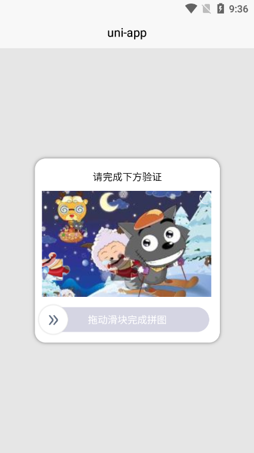
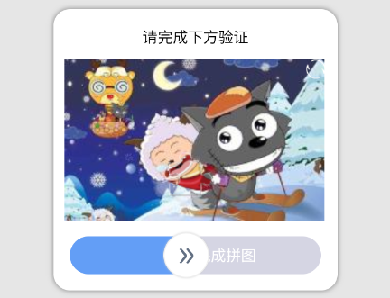

### 预览





### 概述

基于uni-app开发的滑动验证码组件


### 主要功能

滑动验证码


### 演示

````html
<template>
  <view>
    <o-code
      v-show="show"
      :bg="bg" 
      :slider="slider"
      closeable
      closeOnClickOverlay
      :overlayOpacity="0.3"
      :channelText="'滑动完成验证'"
      endToStart
      @change="changeCode"
      @close="closeCode"
      @refresh="refreshCode"
    ></o-code>
  </view>
</template>
<script>
import OCode from '../../component/o-code/o-code.vue';
import imgInfo from './base64Img';
export default {
  components: { OCode },
  data() {
    return {
      show: true,
      bg: {
        src: imgInfo.bgImg,// 背景图片路径
        width: 240, // 背景图片大小
        height: 150,
        mode: "aspectFit" // 显示模式
      },
      slider: {
        src: imgInfo.slider,// 滑块图片路径
        y: imgInfo.scale * 150, // y轴坐标，这里是根据我自己的后端返回的滑块位置计算方式，根据自己情况而定，如果后端固定y就直接赋值
        width: 40, // 滑块大小
        height: 40
      },
    }
  },
  methods: {
    changeCode({x, y}){
      console.log(`x轴移动了：${x}，y轴不变：${y}`);
    },
    closeCode(e){
      console.log('关闭弹窗');
      this.show = false;
    },
    refreshCode(e){
      console.log('点击了刷新按钮');
    }
  }
}
</script>
````

### API

#### Props

|        参数         |                     说明                      |  类型   |                            默认值                            | 可选值  |
| :-----------------: | :-------------------------------------------: | :-----: | :----------------------------------------------------------: | :-----: |
|        title        |                   标题文字                    | String  |                        请完成下方验证                        |    -    |
|     titleColor      |                   标题颜色                    | String  |                            black                             | css颜色 |
|         bg          |                  验证码底图                   | Object  | {src: "图片链接",mode: "图片展示类型，与image标签mode属性一致",width: 宽度，默认240,height: 高度，默认130} |    -    |
|       slider        |                   滑块图片                    | Object  |  {src: "",y: 0, width: 默认值40, height: 默认值40,mode: ""}  |    -    |
|      closeable      |                 显示关闭按钮                  | Boolean |                            false                             |  true   |
| closeOnClickOverlay | 点击遮罩层关闭弹窗，开启时点击会触发close事件 | Boolean |                            false                             |  true   |
|    overlayColor     |                  遮罩层颜色                   | String  |                             #ccc                             | css颜色 |
|   overlayOpacity    |                 遮罩层透明度                  | Number  |                             0.5                              |   0-1   |
|      channelBG      |               滑动管道背景颜色                | String  |                           #d5d5e3                            | css颜色 |
| channelChangeColor  |           滑动管道滑动时覆盖掉颜色            | String  |                           #639ef6                            | css颜色 |
|     channelText     |               滑动管道内的文字                | String  |                       拖动滑块完成拼图                       |    -    |
|      textColor      |             滑动管道内的文字颜色              | String  |                            white                             | css颜色 |
|  channelChangeText  |              滑动颜色覆盖时文字               | String  |                             null                             |    -    |
|   changeTextColor   |                滑动覆盖时文字                 | String  |                            white                             | css颜色 |
|      boxStyle       |               滑动验证码框背景                | Object  |                  {backgroundColor: 'white'}                  |    -    |
|     endToStart      |                松开后回到起点                 | Boolean |                             true                             |  false  |


#### Events

| 属性名  |       说明       |  类型   |            默认值            |
| :-----: | :--------------: | :-----: | :--------------------------: |
| change  |  松开手指后触发  | Object  | {x：x轴移动距离，y：y轴坐标} |
| refresh | 点击刷新按钮触发 | Boolean |             true             |
|  close  |   关闭弹窗触发   | Boolean |             true             |

#### Slot

|  名称  |        说明         |
| :----: | :-----------------: |
| circle | 滑动按钮插槽，默认» |


