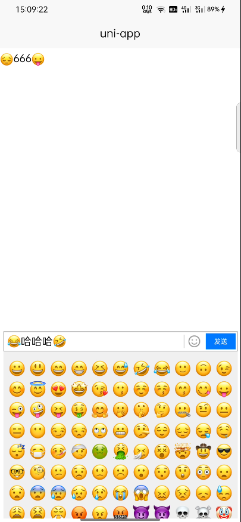
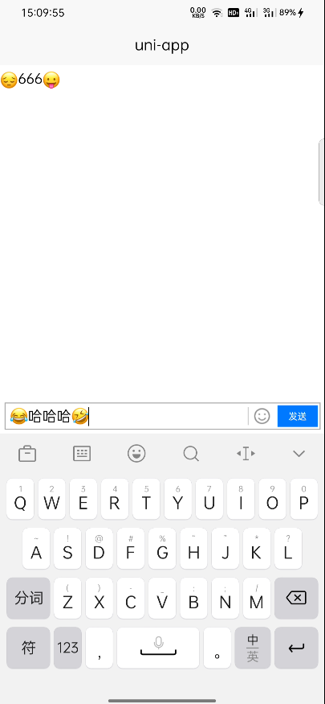

### 预览





### 概述

这是一个基于uni-app内置组件editor开发的输入框插件，包含表情输入

### 主要功能
* 可以出入表情图片的输入框
* 可以获得用户输入的内容html代码以及解析成文本的代码

### 基本用法
````vue
<template>
	<view class="content">
		<o-input></o-input>
	</view>
</template>
````

### 提示

* 由于editor组件的原因，输入框中连续的表情包之间点击可能获取不到焦点，还在改进中。。。

* 插件所使用到表情包都是从[emoji大全](https://emojidaquan.com)中拿到的，作者无版权，仅作演示，商用请自行替换，因此带来的版权问题由使用者自行承担。

### API

#### Props
|      参数      |                             说明                             |  类型   |   默认值   | 可选值  |
| :------------: | :----------------------------------------------------------: | :-----: | :--------: | :-----: |
|    v-model     |                           输入的值                           | String  |     -      |    -    |
|     width      |               输入框宽度，数字、带css单位都可                | String  |   100vw    |    -    |
|     height     |               输入框高度，数字、带css单位都可                | String  |     30     |    -    |
|   emojiSize    |                     输入框中表情图片大小                     | String  |     20     |    -    |
|    fontSize    |                        输入框文字大小                        | Number  |     16     |    -    |
| clickBlankBlur |              点击空白区域是否收起输入框及表情框              | Boolean |    true    |  false  |
|  placeholder   |                        输入框提示文字                        | String  | 请输入内容 |    -    |
|   emojiStyle   |                          表情框样式                          | Object  |     {}     | css属性 |
|     resize     | 输入框是否顶起页面，即如果页面设置`softinputMode`为`adjustResize`就设置当前值为`true` | Boolean |   false    |  true   |

#### Events

|   属性名   |                             说明                             |  类型  |       默认值       |
| :--------: | :----------------------------------------------------------: | :----: | :----------------: |
|   change   | 点击默认的发送按钮时触发，返回输入的内容HTML代码、解析后的文本以及文本长度 | Object | {text,html,length} |
| clickEmoji |                       点击的emoji信息                        | Object |         -          |

#### Slot

|  名称  |                         说明                         |
| :----: | :--------------------------------------------------: |
| prefix |                    输入框前置插槽                    |
| suffix | 输入框后置插槽，可以自定义图标，表情包盒子不发生变化 |
| r-btn  |        按钮位置插槽自定义后change事件不起作用        |

