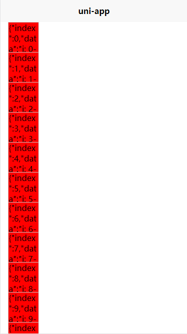
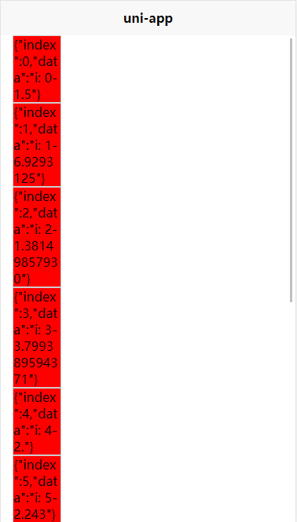

### 概要

基于uniapp实现的虚拟列表

**[组件链接](https://github.com/GeHYang/o-ui/tree/master/component/o-virtual-list)**

### 演示

* **内容高度固定**

通过设置`itemHeight`属性值设置列表项高度，默认为60

````vue
<template>
  <!-- 测试虚拟列表 -->
  <view class="box">
    <o-virtual-list 
      :customStyle="{padding: '0 15px'}" 
      :sourceData="sourceData"
      :itemHeight="60"
      @scrolltoupper="toupper"
    >
			<template v-slot:visual="{ row }">
				<view class="item" style="background-color: red;">{{ JSON.stringify(row) }}</view>
			</template>
    </o-virtual-list>
  </view>
</template>

<script>
import oVirtualList from '../../component/o-virtual-list/o-virtual-list.vue';
export default {
  components: { oVirtualList },
  data() {
    return {
      sourceData: [],
    };
  },
  created(){
  		// 模拟列表数据
		for(let i = 0; i < 100; i++){
			let r = Math.random() * 10 + "";
			this.sourceData.push("i: " + i + '-' + r.substring(0, Math.floor(Math.random() * (r.length - 1)) + 1));
		};
	},
  methods: {
    toupper(e){
      console.log("触发触顶事件");
    }
  }
};
</script>

<style lang='scss' scoped>
.box {
	width: 100vw;
	height: 100vh;

	.item {
        height: 60px
    	border: 1px solid #ccc;
		width: 60px;
   		word-wrap: break-word;
		background-color: blue;
	}
}
</style>
````

效果图



* **内容高度不确定，即根据内容适应高度**

通过设置`estimatedHeight`属性配置列表项预计高度，预估高度不影响实际高度

````vue
<template>
  <!-- 测试虚拟列表 -->
  <view class="box">
    <o-virtual-list 
      :customStyle="{padding: '0 15px'}" 
      :sourceData="sourceData"
      :itemHeight="60"
      :estimatedHeight="10"
      @scrolltoupper="toupper"
    >
			<template v-slot:visual="{ row }">
				<view class="item" style="background-color: red;">{{ JSON.stringify(row) }}</view>
			</template>
    </o-virtual-list>
  </view>
</template>

<script>
import oVirtualList from '../../component/o-virtual-list/o-virtual-list.vue';
export default {
  components: { oVirtualList },
  name: "test-o-virtual-list",
  data() {
    return {
      sourceData: [],
    };
  },
  created(){
		for(let i = 0; i < 100; i++){
			let r = Math.random() * 10 + "";
			this.sourceData.push("i: " + i + '-' + r.substring(0, Math.floor(Math.random() * (r.length - 1)) + 1));
		};
	},
  methods: {
    toupper(e){
      console.log("触发触顶事件");
    }
  }
};
</script>

<style lang='scss' scoped>
.box {
	width: 100vw;
	height: 100vh;

	.item {
    // height: 60px;
    border: 1px solid #ccc;
		width: 60px;
    word-wrap: break-word;
		background-color: blue;
	}
}
</style>
````

效果图



### API

#### Props

|      参数       |                  说明                  |  类型  | 默认值 | 可选值 |
| :-------------: | :------------------------------------: | :----: | :----: | :----: |
|   sourceData    |                 数据源                 | Array  |   []   |   -    |
|   itemHeight    |               列表项高度               | Number |   60   |   -    |
| estimatedHeight | 列表项预估高度，设置时`itemHeight`失效 | Number |   0    |   -    |
|   customStyle   |                列表样式                | Object |   -    |   -    |

#### Events

|    属性名     |                 说明                 |    类型     | 默认值 |
| :-----------: | :----------------------------------: | :---------: | :----: |
| scrolltoupper | 滑动触顶时触发，列表不足以滚动时无效 | EventHandle |   -    |
| scrolltolower | 滑动触底时触发，列表不足以滚动时无效 | EventHandle |   -    |

#### Slot

|  名称  |                             说明                             |
| :----: | :----------------------------------------------------------: |
| visual | 插槽返回`row`参数，参数内容{`index`：列表项在源数据中的索引，`data`：列表项原值} |

